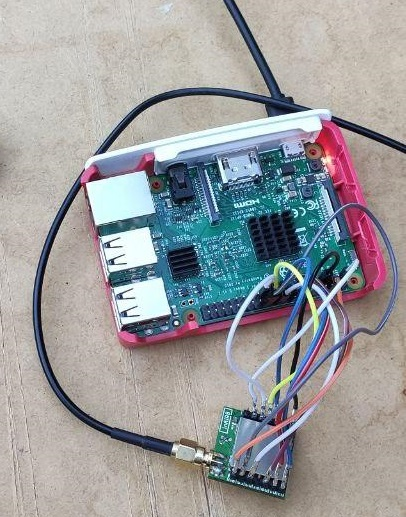

# LoRaWAN

Fork in the repository https://github.com/jeroennijhof/LoRaWAN based in https://github.com/mayeranalytics/pySX127x. 

## Hardware:

- [inAir9B](http://modtronix.com/inair9.html) (Wireless SX1276 LoRa Module, 868MHz and 915MHz, 3.3V, SMA Connector).
- Raspberry Pi 3

## Pin Connection: 

| Proto board pin | RaspPi GPIO |
| :-------------- | :---------: |
| inAir9B DIO0    |   GPIO 22   |
| inAir9B DIO1    |   GPIO 23   |
| inAir9B DIO2    |   GPIO 24   |
| inAir9B DIO3    |   GPIO 25   |
| VS(VSwitch)     |   GPIO 4    |
| inAir9B 3V3     |   GPIO 01   |
| inAir9B V0(GND) |   GPIO 06   |
| inAir9B CK      |   GPIO 11   |
| inAir9B SO      |   GPIO 09   |
| inAir9b SI      |   GPIO 10   |
| inAir9b CS      |   GPIO 08   |

**OPTIONAL: ** Change the pin connection in** [board_config.py](https://github.com/rubenleon/LoRaWAN/blob/master/SX127x/board_config.py)

​        `  DIO0 = 22   # RaspPi GPIO 22`
`​    DIO1 = 23   # RaspPi GPIO 23`
`​    DIO2 = 24   # RaspPi GPIO 24`
`​    DIO3 = 25   # RaspPi GPIO 25`
`​    LED  = 18   # RaspPi GPIO 18 connects to the LED on the proto shield`
`​    SWITCH = 4  # RaspPi GPIO 4 connects to a switch`
​    

## Test Photo: 

## Test in python: 

You can now run the script. For example dump the registers with `lora_util.py`:

> sudo python3 lora_util.py